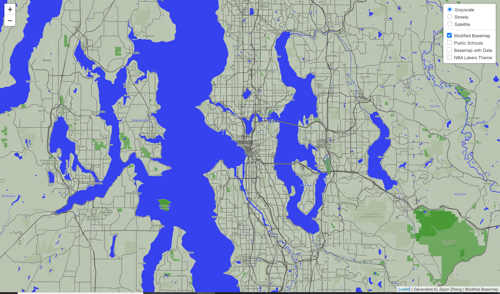
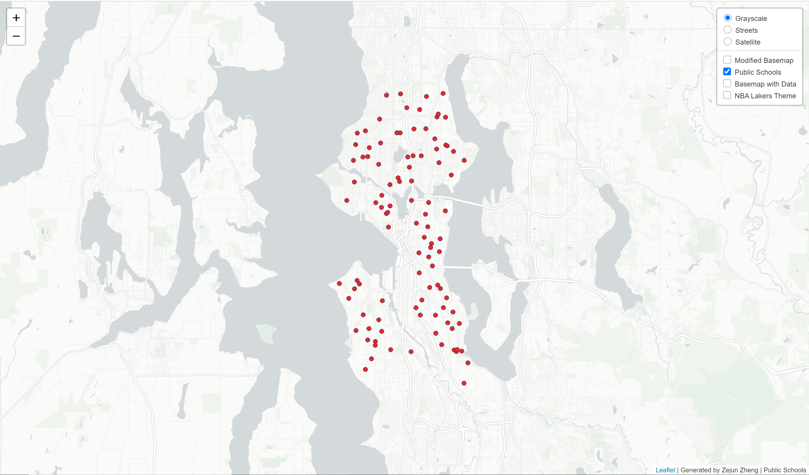
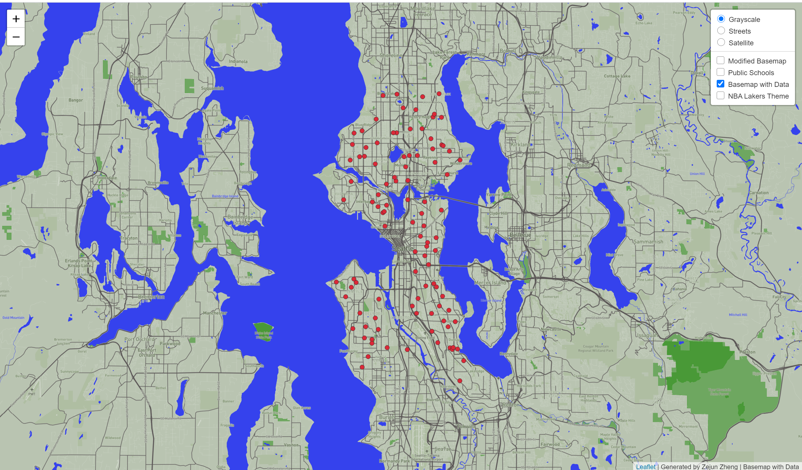
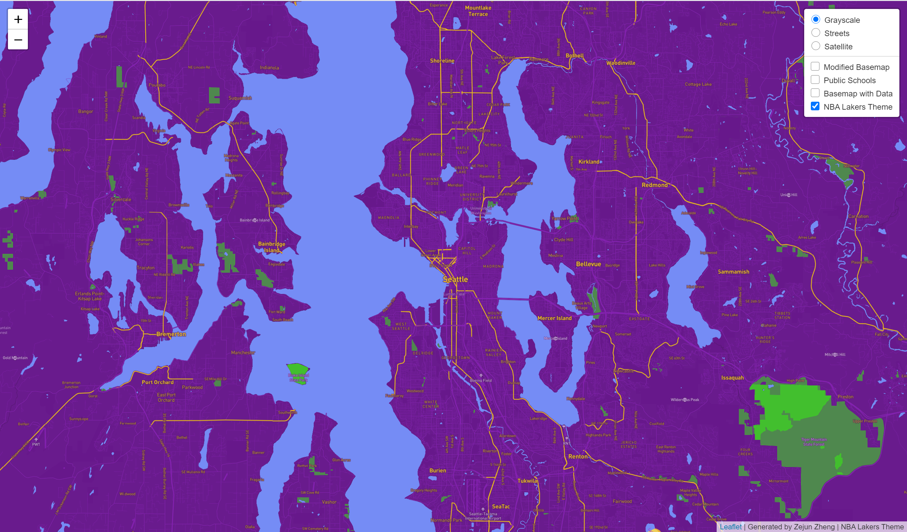

# GEOG458_Lab4: Wedmap of Modified Basemap and Thematic Map

Link to the Webmap: https://zejunoliviazheng.github.io/Tile_Generation.io/

## Tile 1 - Modified Basemap

- Description of Tile: Modified basemap simplified to reduce the number of labels on places and roadways, highlighting parkland and major roadways/highways in the seattle are. 
- Geographic Area of Focus: Seattle, WA and surrounding areas 
- Zoom Levels: Max Zoom - 13; Min Zoom - 11

## Tile 2 - Map Data (Public Schools, Seattle)

- Description of Tile: Data layer showing the location of buildings constructed using unreinforced masonry building practices. 
- Geographic Area of Focus: Seattle, WA
- Zoom Levels: Max Zoom - 13; Min Zoom - 11

## Tile 3 - Basemap and Data 

- Description of Tile: Tile utilizing the modified basemap from Tile 1 & the map data from Tile 2
- Geographic Area of Focus: SSeattle, WA and surrounding areas
- Zoom Levels: Max Zoom - 13; Min Zoom - 11

## Tile 4 - NBA Lakers Theme

- Description of Tile: Map tile made using the color scheme from the former Seattle Supersonics NBA team. 
- Geographic Area of Focus: Seattle, WA and surrounding areas
- Zoom Levels: Max Zoom - 13; Min Zoom - 11
